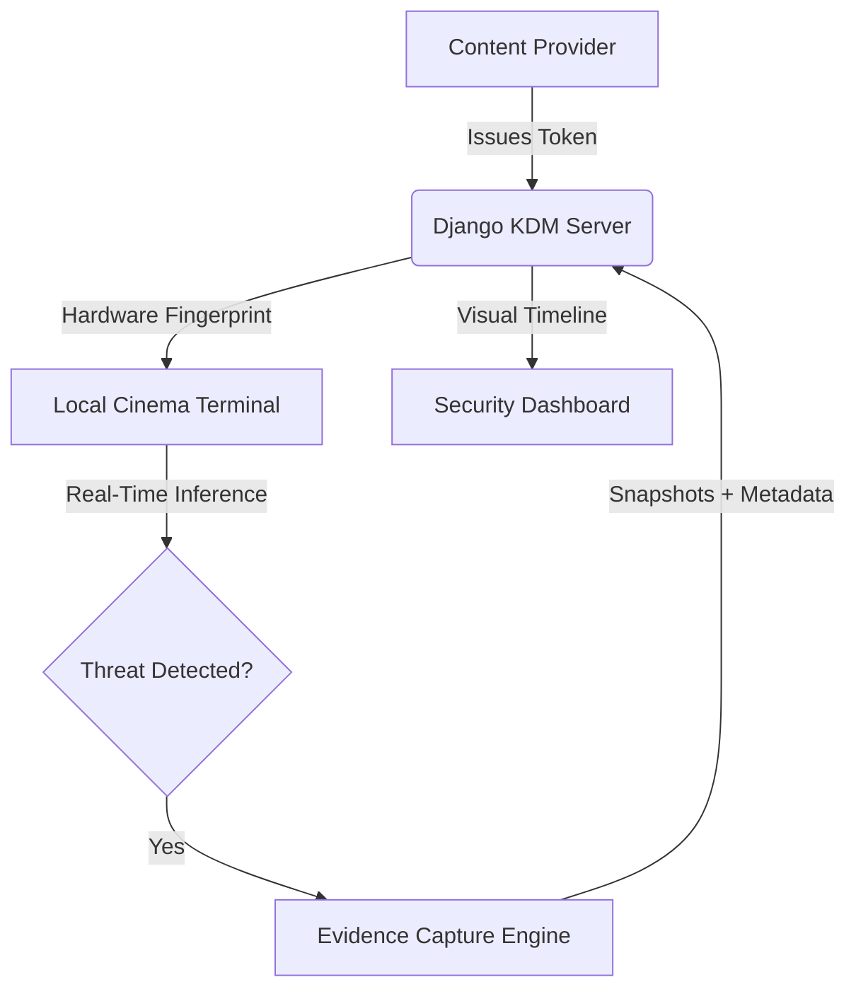

# 🛡️ TheatreShield AI
**Forensic-Oriented Anti-Piracy Platform for Modern Cinema**

TheatreShield AI is an end-to-end prototype system designed to explore how Edge AI and secure distribution techniques can mitigate in-theatre movie piracy. The platform integrates **KDM-inspired access control** with **Real-Time Computer Vision** to detect, identify, and capture forensic evidence of illegal recording activity.

---

## 🚀 Project Overview

Cinema piracy often originates from high-quality "cam" recordings. While traditional systems focus purely on securing the distribution file, **TheatreShield AI** explores an integrated defense-in-depth approach:

**🔐 Secure Distribution** → **🎥 Real-Time Detection** → **📸 Evidence Capture** → **📊 Forensic Analysis**

---

## 🧠 Key Innovation: "Persistence Intelligence"

Traditional object detection is notoriously unstable in low-light environments due to motion blur, occlusion, and light bleed from the screen. TheatreShield AI introduces a **Tiered Threshold Tracking** algorithm to ensure stability:

> [!IMPORTANT]
> **The Stability Loop:**
> 1. **Latch Threshold (50%):** Detection initiates only when the AI is highly confident of a device.
> 2. **Maintain Threshold (15%):** Once "latched," the system holds the detection even if confidence dips during fast movement or blur.
> 3. **Verification Buffer:** A 5-second temporal check filters out transient false positives (e.g., checking a watch).
> 4. **Forensic Capture:** Automatically composites and saves high-res frames with detection overlays.

---

## ✨ Features

### 🔐 Secure Movie Distribution (KDM-Inspired)
*   **Hardware-ID Binding:** Playback is cryptographically restricted to a specific device fingerprint (simulated via unique `localStorage` hardware keys).
*   **Temporal Fencing:** Valid From / Valid Until constraints ensure tokens only work during authorized screening windows.
*   **Anti-Replay Protection:** Usage counters prevent tokens from being "leaked" and reused across multiple sessions.
*   **Backend Validation:** A centralized Django API enforces all access rules before authorizing a playback stream.

### 🎥 AI Surveillance & Detection
*   **Edge-Inference Pipeline:** Runs 100% in-browser using **TensorFlow.js**, ensuring zero-latency monitoring without expensive server-side GPUs.
*   **Real-Time Threat ID:** Specifically tuned to detect mobile phones, tablets, and laptops in difficult lighting.
*   **Sector-Based Mapping:** Maps detections to specific "Sectors" (e.g., Sector-11, Sector-22) for rapid physical identification by security teams.

### 📸 Forensic Intelligence System
*   **Automated Snapshot Capture:** Generates a high-resolution JPEG evidence file merging raw video with AI bounding boxes.
*   **Incident Gallery:** A chronological "Visual Timeline" allowing security operators to review historical data and thumbnails.
*   **Forensic Flash:** On-screen visual pulse confirms that evidence has been successfully persisted to the database.

---

## 🔐 Cryptography: Architectural Accuracy

TheatreShield AI follows the architectural principles of real-world digital cinema security (DCI/SMPTE standards) while maintaining a lightweight prototype layer for simulation.

| Concept | Simulation (Prototype Layer) | Architectural Reality (Production) |
| :--- | :--- | :--- |
| **Token Format** | Simplified UUID | SMPTE-standard XML (DCP/KDM) |
| **Encryption** | Backend access authorization | AES-128 Content Encryption |
| **Key Wrapping** | Database-level logic | RSA Public/Private Key Exchange |
| **Binding** | Unique Device Fingerprint | Digital Certificates & SM Hardware |

---

## 🛠️ Technology Stack

*   **Frontend:** React 18, Vite, Tailwind CSS, Lucide Icons
*   **Backend:** Django REST Framework, SQLite
*   **AI Engine:** TensorFlow.js, COCO-SSD (MobileNetV2 Backbone)
*   **Architecture:** Hexagonal UI + RESTful API State Management

---

## 📜 System Architecture



---

## ⚙️ Setup & Installation

### 1. Prerequisites
*   Node.js (v16+)
*   Python (v3.10+)

### 2. Backend Setup
```bash
cd backend
python -m venv venv
source venv/bin/activate  # Windows: venv\Scripts\activate
pip install -r requirements.txt
python manage.py migrate
python manage.py runserver
```

### 3. Frontend Setup
```bash
cd frontend
npm install
npm run dev
```

---

## ⚠️ Limitations & Considerations
*   **Model Optimization:** Currently uses the COCO-SSD general-purpose model; for production, a custom-trained theatre-specific model is recommended.
*   **Environmental Factors:** Detection accuracy may be affected by extreme occlusion or pitch-black environments without IR assist.
*   **Security Stage:** KDM logic is an architectural simulation designed for workflow demonstration.

---

**Developed for the future of Secure Cinema.** 🎬🔒